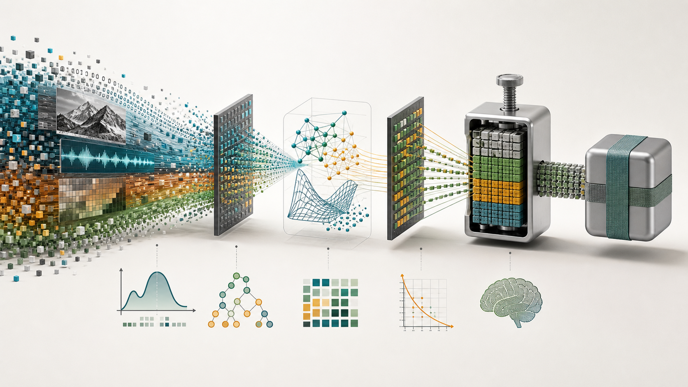
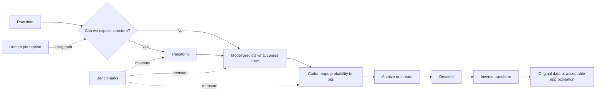
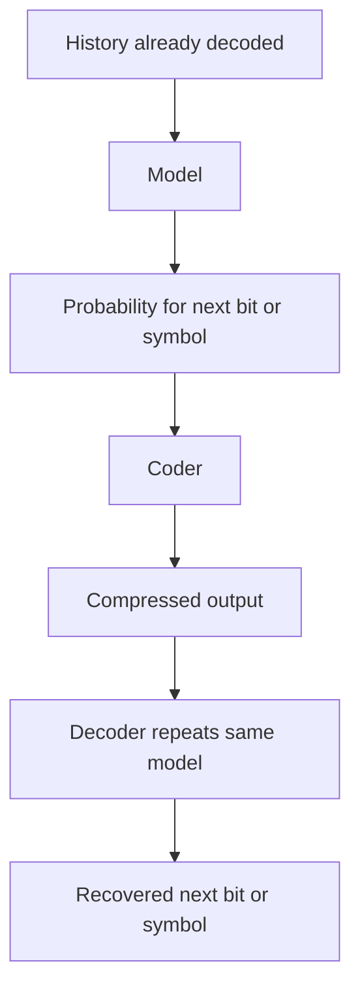
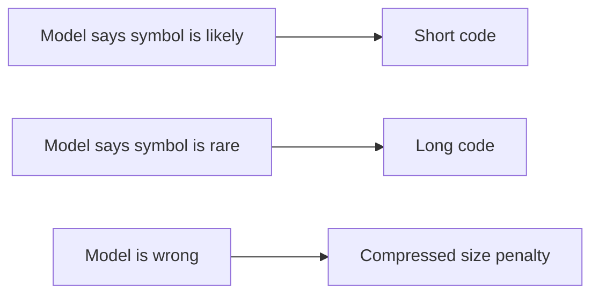
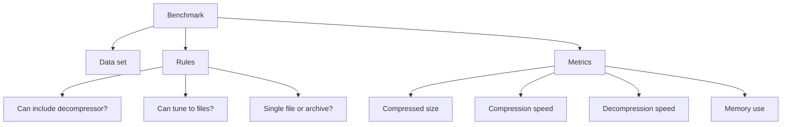
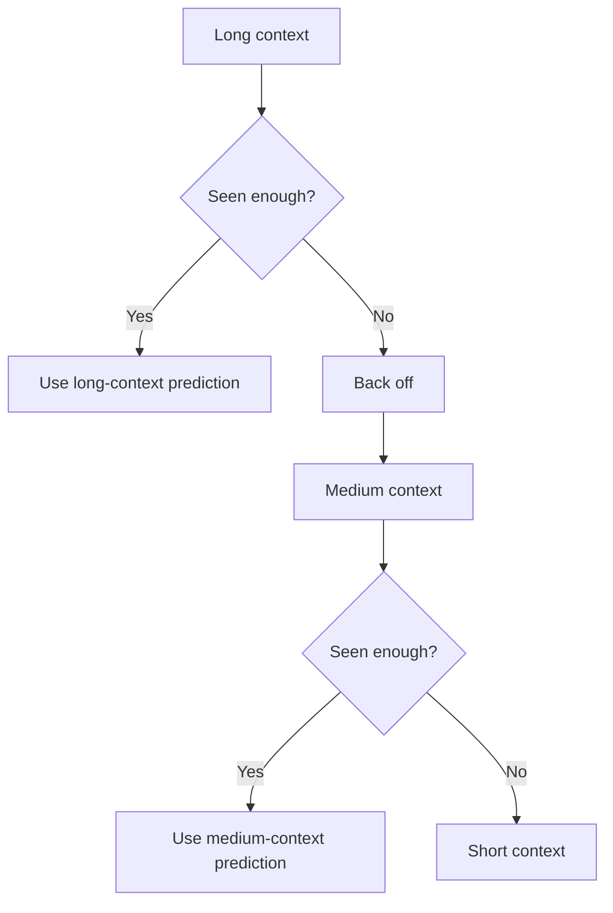
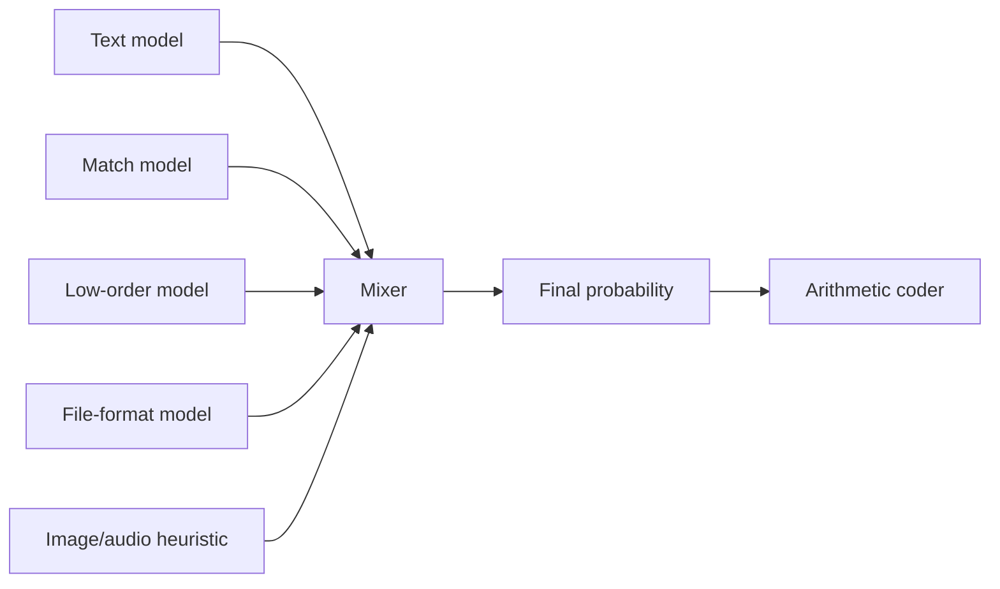
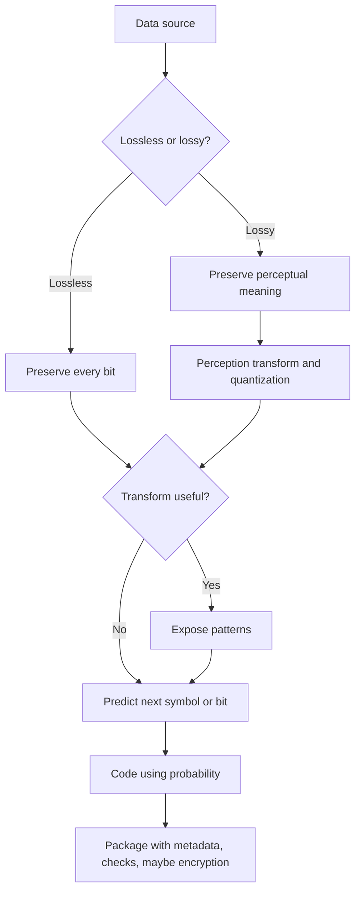

# Data Compression Explained: A Visual Guide to the Whole Book



| Property | Value |
| --- | --- |
| Source | [Data Compression Explained](https://mattmahoney.net/dc/dce.html) |
| Original author | Matt Mahoney |
| Source last update | Apr. 15, 2013 |
| Draft type | Visual Notion blog post / study guide |
| Audience | Developers, technical writers, ML engineers, compression-curious readers |
| Core idea | Compression is prediction plus coding, with transforms and perception models doing the heavy lifting. |

> Source note: This post is an original visual study guide based on Matt Mahoney's book. It paraphrases and organizes the ideas for blog reading. It is not a redistributed copy of the book. Historical benchmark numbers and tool rankings should be read in the context of the source's 2013 update.

## The Whole Book in One Picture



Compression looks like file shrinkage, but the book frames it as a deeper engineering problem:

| Layer | Question | Main chapters |
| --- | --- | --- |
| Theory | What is compressible at all? | 1 |
| Measurement | How do we compare compressors fairly? | 2 |
| Coding | Given probabilities, how many bits are needed? | 3 |
| Modeling | Where do good probabilities come from? | 4 |
| Transforms | How do we rearrange data so simple models work? | 5 |
| Lossy compression | What can we throw away without humans noticing? | 6 |

The shortest honest summary:

> Compression is the search for shorter descriptions. Coding is mostly solved. Modeling is the hard part. Transforms make modeling easier. Lossy compression adds a model of human perception.

## Fast Mental Models

### 1. Bits Measure Surprise

If an event has probability `p`, the ideal code length is:

```text
ideal bits = log2(1 / p) = -log2(p)
```

| Probability | Surprise | Intuition |
| --- | ---: | --- |
| `1/2` | 1 bit | A fair yes/no question |
| `1/4` | 2 bits | One outcome among four equal choices |
| `1/256` | 8 bits | One byte under a uniform byte model |
| Near 1 | Near 0 bits | Almost expected |
| Near 0 | Many bits | Very surprising |

Visual rule:

```text
common symbol     -> short code
rare symbol       -> long code
unknown pattern   -> expensive code
understood pattern -> tiny description
```

### 2. Compression Is Prediction



The compressor and decompressor must make the same predictions from the same history. The compressed file mainly stores the information that the model could not predict.

### 3. Lossy Compression Is Perception-Aware Prediction

```text
Lossless: recover exactly the same bits.
Lossy: recover something humans judge close enough.
```

That one change moves the problem from pure information theory into psychology, vision, hearing, language, and AI.

## Chapter Map

| Chapter | Visual handle | What it teaches |
| --- | --- | --- |
| 1. Information Theory | Limits map | Why random data cannot be compressed and why modeling matters more than coding. |
| 2. Benchmarks | Tradeoff dashboard | How size, speed, memory, data set choice, and rules change compressor rankings. |
| 3. Coding | Probability-to-bits machine | Huffman, arithmetic coding, asymmetric coding, numeric codes, archives, checksums, encryption. |
| 4. Modeling | Prediction engine | Fixed-order models, variable-order models, context mixing, PAQ, ZPAQ, and why modeling is hard. |
| 5. Transforms | Pattern-exposure tools | RLE, LZ77, LZW, BWT, filters, executable transforms, precompression. |
| 6. Lossy Compression | Human sensor model | Images, video, audio, JPEG, MPEG, psychoacoustics, and recompression. |

---

# 1. Information Theory

## Compression Starts with a Count

There are `2^n` different binary strings of length `n`. There are fewer than `2^n` shorter binary strings. Therefore, no lossless compressor can make every `n`-bit input shorter while still allowing perfect decompression.

```text
All n-bit inputs:

[000...000] [000...001] [000...010] ... [111...111]
       count = 2^n

Possible shorter outputs:

[] [0] [1] [00] [01] ... [length < n]
       count = 2^n - 1

One-to-one decoding cannot map more inputs into fewer outputs.
```

The key result:

| Claim | Meaning |
| --- | --- |
| No universal compression | A compressor that shrinks every file cannot exist. |
| Some files must expand | If a compressor shrinks some inputs, it must make other inputs longer or refuse them. |
| Random-looking data is usually incompressible | Most possible strings have no shorter description. |
| Useful data is often compressible | Human-created data usually has patterns, constraints, formats, repetition, and meaning. |

## Why Meaningful Data Compresses

Most possible strings are random. Most strings people store are not:

| Data | Why it has structure |
| --- | --- |
| English text | Grammar, vocabulary, topic, repeated words, spelling patterns |
| Source code | Keywords, syntax, indentation, identifiers, libraries |
| Images | Neighboring pixels are correlated |
| Audio | Samples are correlated over time and filtered by human hearing |
| Executables | Instructions, addresses, headers, imported symbols |
| Backups | Files repeat across versions and machines |

Compression works because our data is not drawn uniformly from all possible bit strings. It comes from processes with structure.

## Coding Is Bounded

If a model says a symbol has probability `p`, the best possible code length is approximately `-log2(p)` bits. You can choose a bad coder and waste bits, but no coder can beat the model's information content for all data drawn from that model.



The lesson is subtle:

| Part | Status |
| --- | --- |
| Turning probabilities into bits | Efficient, well-understood |
| Finding the right probabilities | Hard, open-ended, data-dependent |

## Modeling Is Not Computable

A better model can turn a long string into a tiny description. For example, a million digits of `pi` can be treated as random-looking decimal digits, or as "compute the first million digits of pi." The second description is dramatically shorter, but it requires recognizing the source.

```text
weak model:
314159265358979323846...
-> "digits look independent"
-> many bits

strong model:
314159265358979323846...
-> "this is pi"
-> short program or description
```

The book connects this to Kolmogorov complexity: the shortest program that outputs a string is an ideal compressed representation, but there is no general algorithm that can always find it.

## Compression and AI

Prediction is a sign of understanding:

| If a system understands... | It can predict... |
| --- | --- |
| English | likely next words |
| Images | likely neighboring pixels |
| Audio | likely future samples |
| Code | likely syntax and instruction patterns |
| File formats | likely headers, fields, and constraints |

This is why compression and AI meet. A compressor that understands a data source can describe it more compactly. A perfect general compressor would need a very broad kind of understanding.

## Chapter 1 Takeaways

| Takeaway | Why it matters |
| --- | --- |
| Random data cannot be compressed | Do not expect magic from encrypted, already-compressed, or random data. |
| Compression is model plus coder | Separate probability estimation from bit representation. |
| Coding has mathematical limits | Better coding helps, but only up to the model's quality. |
| Modeling is the hard problem | Better compression usually comes from better prediction. |
| Understanding creates compression | The more structure you can exploit, the shorter the description. |

---

# 2. Benchmarks

## What Benchmarks Actually Measure

Compression benchmarks compare compressors on a chosen data set under chosen rules.



The big triangle:

```text
                 smaller output
                       /\
                      /  \
                     /    \
                    /      \
                   /        \
        less memory -------- faster speed
```

You usually cannot optimize all three at once. Maximum compression tools are often slow and memory-hungry. Practical formats often give up ratio to win speed, streaming, random access, or compatibility.

## Bits Per Character

The book often uses `bpc`, or bits per character, for byte-oriented corpora.

| bpc | Meaning |
| ---: | --- |
| 8.0 | No compression for byte data |
| 6.0 | 25 percent smaller than original |
| 4.0 | Half the original size |
| 2.0 | One quarter of original size |
| Lower | Better compression, assuming the same input data |

## Benchmark Landscape

| Benchmark | What it emphasizes | Why it matters |
| --- | --- | --- |
| Calgary Corpus | Classic mixed small files | Historical baseline for text compression research. |
| Large Text Compression Benchmark | Large Wikipedia XML text | Natural language modeling and long-range structure. |
| Hutter Prize | Compression as AI research | Rewards improvements on a fixed text corpus with decompressor included. |
| Maximum Compression | Maximum ratio on mixed files | Encourages aggressive tuning for size. |
| Generic Compression Benchmark | Untuned universal prediction | Tests generality rather than file-type tricks. |
| Compression Ratings | Size and speed scoring | Makes tradeoffs adjustable by user preference. |
| Other public benchmarks | Multiple corpora and rule sets | Shows that rankings depend on test design. |
| File system studies | Real-world storage mix | Reveals what data actually exists on machines. |

## Why Rankings Shift

Two compressors can trade places when any of these changes:

| Variable | Effect |
| --- | --- |
| Data type | Text, images, executables, backups, logs, and audio favor different methods. |
| File size | Small files make headers and model startup costs visible. |
| Archive rules | Solid archives can exploit similarity across files. |
| Decompressor inclusion | Including source or executable rewards simpler decoders. |
| Memory limit | Large models can dominate if memory is unrestricted. |
| Speed limit | Slow context mixers may lose to practical LZ-family tools. |
| Tuning policy | Per-file options can inflate benchmark-specific performance. |

## Visual: Benchmark as a Dashboard

```text
+--------------------------------------------------+
| Compressor: example                              |
+-------------------+------------------------------+
| Size              | 1.95 bpc                     |
| Compression time  | slow                         |
| Decompression     | medium                       |
| Memory            | high                         |
| Decoder included  | yes                          |
| Data set          | text-heavy                   |
| Good use case     | archival / research          |
+-------------------+------------------------------+
```

## Chapter 2 Takeaways

| Takeaway | Why it matters |
| --- | --- |
| Benchmarks are not neutral | They encode assumptions about data and priorities. |
| Size is only one metric | Real systems care about speed, memory, streaming, and compatibility. |
| Historical leaderboards age | Use the book's rankings as context, not current product advice. |
| Data set choice dominates | A compressor can look brilliant on one corpus and ordinary on another. |
| A benchmark is a contract | Read the rules before interpreting the chart. |

---

# 3. Coding

## Coder Job Description

A coder receives probabilities from a model and emits bits close to the theoretical ideal.


The coder must be:

| Requirement | Reason |
| --- | --- |
| Decodable | The original symbols must be recoverable. |
| Efficient | Common symbols should use fewer bits. |
| Synchronized | Decoder must reproduce the same boundaries and model states. |
| Practical | Real files need headers, error checks, and sometimes encryption. |

## Huffman Coding

Huffman coding builds a prefix tree. Frequent symbols sit near the root. Rare symbols sit deeper.

```text
              root
             /    \
          common   *
                  / \
              medium rare
```

Core idea:

| Symbol probability | Huffman effect |
| --- | --- |
| High | Shorter integer number of bits |
| Low | Longer integer number of bits |
| Exact powers of 1/2 | Very efficient |
| Awkward probabilities | Wastes some space due to whole-bit code lengths |

Strengths:

- Simple.
- Fast.
- Widely used.
- Good with static or block models.

Limits:

- Code lengths are whole numbers of bits.
- Binary alphabets cannot be compressed by basic Huffman alone.
- A full table or canonical description may need to be stored.

## Arithmetic Coding

Arithmetic coding represents an entire message as a subinterval inside `[0, 1)`.

```text
Initial interval:
[0 ------------------------------------------------ 1)

After likely symbol:
[0 -------- 0.7)

After next symbol:
[0.28 --- 0.42)

After more symbols:
[0.314159 ----------------)

Output a binary number inside the final interval.
```

Why it matters:

| Feature | Benefit |
| --- | --- |
| Fractional bit efficiency | Avoids Huffman's whole-bit rounding. |
| Works well for binary prediction | Ideal for bitwise models. |
| Adapts naturally | Model can update after every symbol. |
| Near-Shannon performance | Strong practical coding method. |

## Asymmetric Binary Coding

Asymmetric binary coding is another way to code predicted bits efficiently. It uses a single integer-like state rather than arithmetic coding's interval endpoints. It matters because the same theory can be implemented with different machine-level tradeoffs.

| Coding family | Mental model |
| --- | --- |
| Huffman | Tree of prefix codes |
| Arithmetic/range | Shrinking probability interval |
| Asymmetric binary | State machine that packs bits according to probability |

## Numeric Codes

Some values are not arbitrary symbols. They are counts, offsets, lengths, or prediction errors. Numeric codes exploit common number distributions.

| Code | Good for | Visual shape |
| --- | --- | --- |
| Unary | Very small positive integers | `0`, `10`, `110`, `1110` |
| Rice | Geometric-like distributions with power-of-two parameter | quotient plus remainder |
| Golomb | Geometric-like distributions with flexible parameter | quotient plus bounded remainder |
| Extra-bit codes | Ranges with extra low bits | length classes and offset details |

These appear in systems where the model says "small numbers are common, large numbers are rare."

## Archive Formats

A compression algorithm is not the whole file format. Archives also need structure.


Important archive concerns:

| Concern | Why it matters |
| --- | --- |
| Single-file vs multi-file | Affects metadata and file recovery. |
| Solid compression | Similar files compressed together can shrink more. |
| Random access | Solid archives may make one-file extraction slower. |
| Error detection | Detects corruption after storage or transmission. |
| Encryption | Protects confidentiality but makes data look random afterward. |

## Error Detection

| Method | What it catches |
| --- | --- |
| Parity | Simple odd/even bit errors, weak but cheap. |
| CRC-32 | Common accidental corruption check. |
| Adler-32 | Fast checksum used in some compression contexts. |
| Cryptographic hash | Strong integrity identity, designed against adversarial collisions. |

Error detection is not compression, but production archives need it.

## Chapter 3 Takeaways

| Takeaway | Why it matters |
| --- | --- |
| Coding maps probability to bits | It is the final packing step. |
| Huffman is simple but rounded | Whole-bit lengths are a real limitation. |
| Arithmetic coding is closer to ideal | It fits adaptive and binary models well. |
| Numeric codes encode structured integers | They are useful for lengths, offsets, runs, and errors. |
| Archives are systems | Metadata, checks, encryption, and extraction rules matter. |

---

# 4. Modeling

## The Hard Part

A model estimates what comes next. Once we have a good probability, coding is mechanical. The model decides whether compression is mediocre or excellent.

```text
history:  "the quick brown "
model:    next symbol is likely "f", "d", "c", ...
coder:    short code for likely next symbol
```

Static vs adaptive:

| Model type | How it works | Tradeoff |
| --- | --- | --- |
| Static | Analyze data, send model, then coded data | Good if model cost is small and data is stable. |
| Adaptive | Update model as data is read | Avoids sending full model, tracks local changes. |

## Fixed-Order Models

An order `n` model predicts the next symbol from the previous `n` symbols.

```text
Order 0: no context
P(next)

Order 1: one previous symbol
P(next | previous)

Order 3: three previous symbols
P(next | previous_3, previous_2, previous_1)
```

Example:

| Context | Next-symbol table |
| --- | --- |
| `q` | `u` is very likely in English |
| `th` | `e`, `a`, `i`, `o` are plausible |
| `ing` | space, punctuation, or suffix continuation |

Why fixed order breaks:

| Order too low | Misses useful context. |
| Order too high | Most contexts are rare or unseen. |
| Result | Need smoothing, fallback, or variable order. |

## Bytewise, Bitwise, and Indirect Models

| Model style | Unit | Useful when |
| --- | --- | --- |
| Bytewise | Predict next byte | Text, simple binary data, byte-aligned formats. |
| Bitwise | Predict next bit | Arithmetic coding, mixed binary patterns, precise probability updates. |
| Indirect | Use hashed or transformed contexts | Large context spaces where full tables are too costly. |

## Variable-Order Models

Variable-order models keep statistics for multiple context lengths and choose or mix them.



### DMC

Dynamic Markov Coding predicts bits with a state machine that grows as it observes data. It can split states when histories diverge.

Visual:

```text
state A --0--> state B
state A --1--> state C

if state A is too vague:
state A becomes A1 and A2
```

### PPM

Prediction by Partial Matching uses byte contexts and backs off from longer to shorter contexts. It is a classic text-compression idea.

```text
Try context "tion"
if unknown, try "ion"
if unknown, try "on"
if unknown, try "n"
if unknown, try order 0
```

The hard detail is handling symbols that have not appeared in a context, often called the escape or zero-frequency problem.

### CTW

Context Tree Weighting mixes context tree predictions in a principled bitwise way. Instead of choosing only one context, it combines evidence across a tree.

## Context Mixing

Context mixing uses many predictors at once.



The mixer can learn which predictors are useful in each situation.

| Component | Role |
| --- | --- |
| Linear evidence mixing | Combine model outputs with weighted evidence. |
| Logistic mixing | Mix in probability/logit space for better behavior. |
| SSE | Secondary Symbol Estimation adjusts predictions using past calibration. |
| ISSE | Indirect SSE uses contexts to select or adapt estimators. |
| Match model | If current data matches earlier data, predict continuation from the match. |
| PAQ models | High-compression family using context mixing. |
| ZPAQ | A more configurable/archive-oriented successor in the PAQ family. |
| Crinkler | Specialized compression/linking for executable code size competitions. |

## Why Context Mixing Can Beat Single Models

Different predictors notice different kinds of structure:

| Predictor | Notices |
| --- | --- |
| Low-order byte model | Local byte frequencies |
| Word model | Language-level repetition |
| Match model | Exact repeated substrings |
| Image model | Neighboring pixel relationships |
| Executable model | Instruction and address patterns |
| XML model | Tags, attributes, markup rhythm |

Compression improves when the mixer learns which predictor is trustworthy right now.

## Chapter 4 Takeaways

| Takeaway | Why it matters |
| --- | --- |
| Modeling is prediction | The compressed file stores surprises. |
| Fixed order is simple but brittle | Context length must match the data. |
| Variable order handles sparse contexts | Backoff avoids overconfidence in rare histories. |
| Context mixing is powerful | Many weak specialized models can beat one general model. |
| Better modeling can look like understanding | Language, images, code, and formats all reward domain knowledge. |

---

# 5. Transforms

## What a Transform Does

A transform rewrites data so a simpler model can compress it.


Ideal transform:

| Property | Meaning |
| --- | --- |
| Reversible | Decompression gets the original back exactly. |
| Structure exposing | Repetition, locality, or predictable errors become obvious. |
| Cheap enough | Transform cost must be worth the compression gain. |
| Canonical when possible | Avoid arbitrary choices that add information burden. |

## Run Length Encoding

RLE replaces repeated symbols with a symbol plus a count.

```text
AAAAAABBBBCCCCCCCC

becomes

(A,6) (B,4) (C,8)
```

Best for:

| Good | Bad |
| --- | --- |
| Long repeated runs | Alternating symbols |
| Simple image masks | Natural text |
| Zero-filled data | Already transformed data with few runs |

## LZ77 and the Match Family

LZ77 replaces repeated strings with pointers to previous occurrences.

```text
Input:
ABRACADABRA

Later "ABRA" can become:
(go back 7, copy 4)
```

Visual:

```text
sliding history buffer        lookahead
[ABRACAD]                     [ABRA...]
   ^^^^^
   match reused by pointer
```

Why it is popular:

| Strength | Explanation |
| --- | --- |
| Fast decompression | Decoder mostly copies bytes from earlier output. |
| General-purpose | Works on many repeated byte patterns. |
| Streaming-friendly | Can run with bounded windows. |
| Foundation format | Deflate, LZMA-like families, and many practical tools build on the idea. |

### LZSS

LZSS improves practical LZ77 by only emitting pointers when they save space. Short non-saving matches remain literals.

### Deflate

Deflate combines LZ77-style matches with Huffman coding. It powers common zip/gzip-style compression and survives because it is fast, widely implemented, and compatible.


### LZMA

LZMA pushes stronger modeling around LZ-style matches, often improving ratio at the cost of more CPU and memory.

### LZX, ROLZ, LZP, Snappy, Deduplication

| Method | Main idea | Design center |
| --- | --- | --- |
| LZX | LZ-family compression used in Microsoft contexts | Practical binary/archive compression. |
| ROLZ | Restricts match search by recent contexts | Better match relevance. |
| LZP | Predicts repeated strings from context | Fast prediction of matches. |
| Snappy | Prioritizes very high speed | Low latency over maximum ratio. |
| Deduplication | Replaces repeated chunks across files or systems | Backup and storage efficiency. |

## LZW and Dictionary Encoding

Dictionary methods replace strings with dictionary references.

```text
dictionary:
1 -> the
2 -> compression
3 -> model

text:
the compression model

encoded:
1 2 3
```

Dictionary types:

| Type | Dictionary source |
| --- | --- |
| Fixed | Built into the format or algorithm. |
| Static | Learned from the file and stored with it. |
| Dynamic | Built by compressor and decompressor in lockstep. |

LZW is a dynamic dictionary method historically associated with formats like GIF-era compression. Its broader lesson is that both sides can build the same dictionary without transmitting every entry.

## Dictionary Encoding for Text

Text-specific dictionaries can model:

| Feature | Compression opportunity |
| --- | --- |
| Words | Common words become compact tokens. |
| Capitalization | Store word identity separately from case pattern. |
| Newlines | Model paragraph and line structure. |
| Punctuation | Predict separators and syntax. |
| Word endings | Use morphology and repeated suffixes. |

The stronger the text model, the more the compressor behaves like a small language-aware system.

## Symbol Ranking and Move-to-Front

Move-to-front keeps a list of symbols ordered by recency. If the same few symbols keep appearing in a context, their ranks stay small.

```text
alphabet list:
[A B C D E ...]

read C -> output rank 2, move C to front
[C A B D E ...]

read C again -> output rank 0
```

This works well after transforms like BWT, where local neighborhoods tend to reuse a small set of symbols.

## Burrows-Wheeler Transform

BWT sorts rotations of a block so characters with similar right contexts cluster together. After BWT, a fast local model can often compress well.

Tiny example, conceptually:

```text
Original block:
banana$

Sort rotations:
$banana
a$banan
ana$ban
anana$b
banana$
na$bana
nana$ba

Take last column:
annb$aa
```

The output is not obviously shorter, but it groups context-related symbols. It is usually followed by move-to-front, run-length coding, and entropy coding.


## Predictive Filtering

Numeric data often compresses better as prediction errors.

```text
samples:
100, 103, 105, 106, 108

predict next as previous:
100, +3, +2, +1, +2
```

Small errors are easier to encode than raw values.

| Filter | Used for |
| --- | --- |
| Delta coding | Signals, images, ordered numeric data |
| Color transform | Separating brightness from color differences |
| Linear filtering | Predicting from neighboring samples or pixels |

## Specialized Transforms

| Transform | Target | Idea |
| --- | --- | --- |
| E8E9 | x86 executable code | Normalize relative call/jump addresses so repeated code patterns match better. |
| Precomp | Already-compressed embedded data | Detect and temporarily expand compressed streams inside files so outer compression can work. |
| Huffman pre-coding | Context-mixing speed | Reduce input size before expensive modeling. |

## Chapter 5 Takeaways

| Takeaway | Why it matters |
| --- | --- |
| Transforms do not finish compression | They prepare data for modeling and coding. |
| LZ methods exploit repeated strings | This explains many practical formats. |
| BWT exploits sorted contexts | It turns context into local symbol clustering. |
| Filters exploit smooth numeric data | Prediction errors are often small. |
| Specialized transforms exploit file knowledge | Better compression often comes from knowing the data's format. |

---

# 6. Lossy Compression

## The Big Shift

Lossless compression asks:

```text
Can we reproduce the original bits exactly?
```

Lossy compression asks:

```text
Can we reproduce something humans accept as the same?
```

That makes perception the model.


## Images

Digital images are already approximations of continuous light. Lossy image compression removes detail that the visual system is less sensitive to.

| Human visual fact | Compression use |
| --- | --- |
| Limited spatial resolution | Do not store invisible fine detail. |
| Limited brightness precision | Quantize small intensity differences. |
| Color sensitivity differs from brightness sensitivity | Store chroma at lower precision than luma. |
| Local smoothness is common | Predict pixels from neighbors or transform blocks. |

## Image Format Map

| Format/topic | Role in the chapter |
| --- | --- |
| BMP | Mostly raw pixels, but still an approximation of continuous light. |
| GIF | Palette-based images and simple animation history. |
| PNG | Lossless image compression with filtering. |
| TIFF | Flexible container used in imaging workflows. |
| JPEG | Transform, quantization, and entropy coding for photos. |
| JPEG recompression | Attempts to compress JPEGs further without fully losing practical recoverability. |

## JPEG as a Visual Pipeline


Mental picture:

```text
left side of block frequency table  = broad smooth shape
right side of table                 = fine detail

JPEG keeps more of the left side and throws away more of the right side.
```

Why artifacts happen:

| Artifact | Cause |
| --- | --- |
| Blocking | Independent 8x8 block decisions become visible. |
| Ringing | Lost high-frequency detail near sharp edges. |
| Color bleeding | Reduced chroma detail. |
| Generational loss | Repeated decode/re-encode compounds quantization. |

## JPEG Recompression

JPEG files are already compressed. Recompressors look for remaining structure:

| Strategy | What it tries to exploit |
| --- | --- |
| Better entropy coding | JPEG's stored coefficients may still be coded more compactly. |
| Coefficient modeling | Predict patterns in quantized DCT coefficients. |
| Metadata cleanup | Remove or compact non-image payload. |
| Specialized decoding knowledge | Preserve reconstructable JPEG details while storing them differently. |

The chapter surveys historical approaches such as Stuffit, PAQ-based methods, WinZip behavior, and PackJPG. Treat the named results as historical context.

## Video

Video compression adds time.


Why video compresses:

| Structure | Compression opportunity |
| --- | --- |
| Adjacent frames are similar | Store changes instead of full frames. |
| Objects move | Motion vectors describe block movement. |
| Human vision tolerates some error | Quantize residuals. |
| Scenes contain spatial redundancy | Use image-like compression inside frames. |

## NTSC and MPEG

| Topic | Key idea |
| --- | --- |
| NTSC | Broadcast video is already shaped by human vision, refresh, interlacing, and color compromises. |
| MPEG | Modern-style video coding predicts frames from other frames, stores motion, quantizes transforms, and entropy-codes the result. |

Frame types as a mental model:

```text
I-frame: self-contained image
P-frame: predicted from previous frames
B-frame: predicted from past and future reference frames
```

Tradeoff:

| More prediction | Better compression, more complexity, more latency |
| Less prediction | Easier seeking and editing, larger files |

## Audio

Audio compression uses psychoacoustics: what the ear can and cannot notice.

| Hearing fact | Compression use |
| --- | --- |
| Limited frequency range | Do not store inaudible frequencies. |
| Sensitivity varies by frequency | Allocate bits where hearing is sharpest. |
| Loud sounds mask nearby quiet sounds | Remove masked components. |
| Perceived loudness is logarithmic | Quantization can follow perception. |
| Time masking exists | Sounds can hide nearby sounds in time. |

Audio pipeline:


## Chapter 6 Takeaways

| Takeaway | Why it matters |
| --- | --- |
| Lossy compression discards information | The hard part is choosing information humans will not miss. |
| Media compression is perceptual modeling | Vision and hearing are part of the algorithm. |
| Transform plus quantization is central | Especially for JPEG-like and audio/video systems. |
| Recompression is difficult | Already-compressed data has little easy redundancy left. |
| Perfect lossy compression would require understanding | A movie could theoretically be summarized semantically, but practical systems are far from that. |

---

# The Grand Unifying Model



Every concrete compressor can be placed in this frame:

| Compressor family | Transform | Model | Coder |
| --- | --- | --- | --- |
| gzip/deflate | LZ77 matches | Huffman-coded literals/lengths | Huffman |
| bzip2-style | BWT, MTF, RLE | Local symbol frequencies | Huffman |
| PAQ-style | Often file-aware contexts | Context mixing | Arithmetic/range-like |
| PNG | Image filters | Deflate model | Huffman via deflate |
| JPEG | DCT and quantization | Coefficient/statistical coding | Entropy coding |
| MPEG-like video | Motion prediction and transforms | Residual and motion models | Entropy coding |
| MP3/AAC-like audio | Frequency analysis and masking | Psychoacoustic bit allocation | Entropy coding |

# Practical Reading Paths

## If You Want to Build a Compressor

1. Understand Chapter 1 so you stop expecting impossible wins.
2. Pick a benchmark from Chapter 2 that matches your target data.
3. Implement a simple coder from Chapter 3 or reuse a known one.
4. Start with a simple adaptive model from Chapter 4.
5. Add one transform from Chapter 5 only when it exposes a pattern you can explain.
6. For media, study Chapter 6 before inventing quality knobs.

## If You Want to Choose a Format

| Need | Prefer |
| --- | --- |
| Speed and compatibility | Deflate/gzip/zip-style tools |
| Archival ratio | Stronger LZMA/context-mixing tools, if time is acceptable |
| Text research | PPM/context-mixing/modern language-model-aware approaches |
| Backups | Deduplication plus compression |
| Photos | JPEG-like formats or newer perceptual image codecs |
| Screenshots/graphics | PNG-like lossless image compression |
| Audio/video distribution | Perceptual audio/video codecs |

## If You Want to Understand AI Through Compression

Read Chapter 1 and Chapter 4 together. The essential loop is:

```text
understand pattern -> predict better -> encode surprise only -> shorter file
```

Compression is not just storage optimization. It is a measurable way to ask how much structure a system has discovered.

# Cheat Sheets

## Glossary

| Term | Short definition |
| --- | --- |
| Lossless | Decompression recovers the exact original data. |
| Lossy | Decompression recovers an acceptable approximation. |
| Model | Probability estimator for upcoming symbols or bits. |
| Coder | Converts model probabilities into a bitstream. |
| Transform | Rewrites data to expose compressible structure. |
| Entropy | Expected information content under a probability model. |
| Context | Previously seen data used to predict the next symbol. |
| Adaptive model | Updates as data is processed. |
| Static model | Sent or fixed before coding the payload. |
| Solid archive | Compresses multiple files together to exploit shared structure. |
| BWT | Context-sorting transform that clusters similar-symbol contexts. |
| Quantization | Reducing precision, usually the irreversible part of lossy coding. |
| Psychoacoustics | Modeling what humans can hear. |

## Algorithm Selection Sketch

```text
Mostly repeated bytes?
-> LZ-style match coding

Mostly text?
-> PPM, context mixing, dictionary transforms, or modern language-aware modeling

Mostly smooth numeric samples?
-> predictive filtering plus entropy coding

Mostly photos?
-> perceptual image codec

Mostly backups or VM images?
-> deduplication plus compression

Already encrypted or compressed?
-> expect little or no gain
```

## Red Flags When Evaluating Compression Claims

| Claim | Skeptical question |
| --- | --- |
| Compresses every file | How does it avoid the counting argument? |
| Recompresses compressed data repeatedly | Where does the extra information go? |
| Beats all compressors | On which benchmark and rules? |
| No quality loss in lossy mode | What exact metric or human test supports that? |
| Tiny output with universal recovery | Is the decompressor/model included in the accounting? |

# Closing

The book's central message is practical and philosophical at the same time:

> To compress data, find structure. To find structure, predict. To predict well, understand the source.

That is why the same field contains Huffman trees, probability intervals, dictionaries, suffix sorting, image transforms, psychoacoustics, benchmark politics, and AI. They are all different ways of answering one question:

```text
What is the shortest description that still lets us recover what matters?
```

# Source and Further Reading

- Matt Mahoney, [Data Compression Explained](https://mattmahoney.net/dc/dce.html), last updated Apr. 15, 2013.
- For current tool rankings, consult up-to-date benchmark leaderboards directly; the rankings in the source are historical.
- For implementation practice, start with a simple RLE or Huffman coder, then build toward adaptive modeling, LZ-style matching, or arithmetic/range coding.

